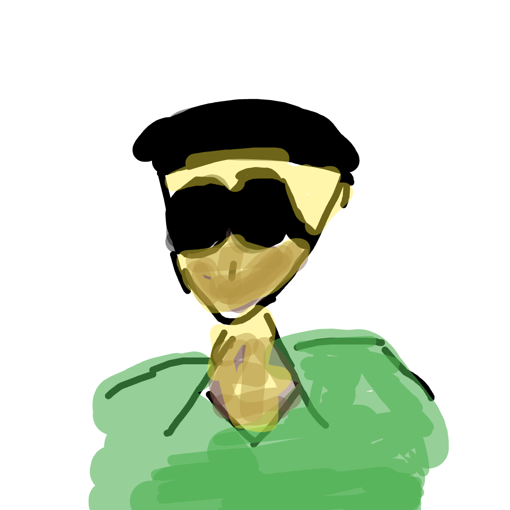

# Digital Doodle

A robust, full-featured drawing application built with **Flutter**. This project demonstrates advanced state management, custom painting performance optimization, and local persistence (CRUD).

<p align="center">
    
    
    
    
    
</p>

## Features

* **Advanced Drawing Engine:** Custom `Stroke` model supporting variable sizes, opacity, and color.
* **Undo / Redo System:** Stack-based history management allowing users to traverse their drawing states.
* **Zoom & Pan:** `InteractiveViewer` integration for infinite canvas navigation and detailed work.
* **Drafts System (CRUD):**
    * **Create:** Auto-save drawing sessions.
    * **Read:** View list of saved drafts with last-edited timestamps.
    * **Update:** Load a draft, modify it, and overwrite or save as new.
    * **Delete:** Swipe-to-delete functionality.
* **Gallery Export:** High-resolution PNG export directly to the device gallery using `RenderRepaintBoundary`.

## Tech Stack

* **Framework:** Flutter (Dart)
* **Rendering:** `CustomPainter` (Optimized for high-performance vector drawing)
* **State Management:** `StatefulWidget` (Clean Architecture)
* **Persistence:** `shared_preferences` (JSON Serialization for drafts)
* **Native Features:** `gal` (Gallery Access), `permission_handler` (Android Permissions)

## Engineering Highlights

### 1. Custom Painting Optimization

Instead of rendering thousands of individual points, the app aggregates input data into `Stroke` objects. This significantly reduces the memory footprint and allows for smooth 60fps rendering even with complex drawings.

### 2. JSON Serialization

To enable the "Save Draft" feature, I implemented custom `toJson` and `fromJson` methods for the `Stroke` and `Point` classes, allowing complex drawing data to be serialized into strings for local storage.

### 3. Infinite Canvas Navigation

Separated the Drawing Mode and Pan/Zoom Mode to solve the gesture conflict problem. Users can toggle modes to either interpret touches as 'paint' or 'manipulate view.'

## Installation

### 1. Clone the repo

```bash
git clone https://github.com/meawsin/Doodleapp.git
```

### 2. Install dependencies

```bash
flutter pub get
```

### 3. Run the app

```bash
flutter run
```

## License

This project is open source and available under the MIT License.